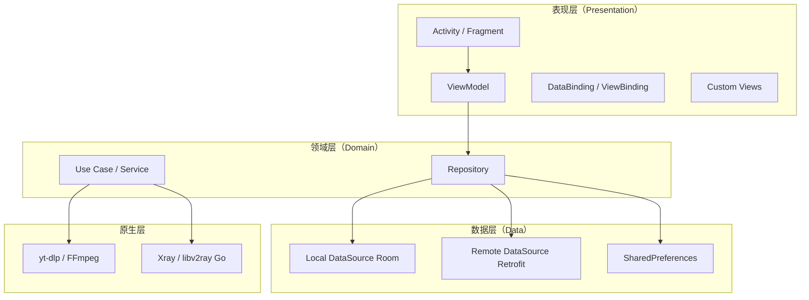
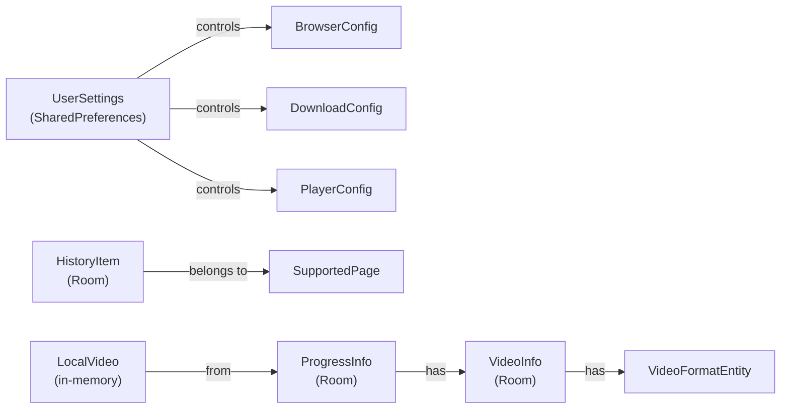
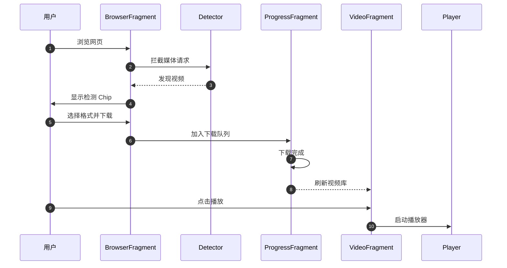

# PROJECTWIKI.md

> SurfSave 项目知识库 —— 唯一可信文档源（SSOT）。
> 当前版本：v0.8.31，最后更新：2026-08-27（媒体候选排序、DRM 网页播放提示与有限的 Telegram 公开帖子导入已落地）。

## 1. 项目概述

- **目标**：提供一款内置浏览器的 Android 视频下载与离线播放工具。
- **背景**：基于 `youtube-dl-android`、`yt-dlp`、`FFmpegKit`、`Xray/libv2ray` 等开源组件构建。
- **范围（In-Scope）**：内置浏览器、媒体检测、多引擎下载、下载队列管理、本地播放器、代理/DoH、设置与备份。
- **非目标（Out-of-Scope）**：突破 DRM 的下载、云端存储、社交分享社区、视频上传。
- **干系人**：终端用户（个人/研究/教育用途）、开源贡献者。
- **运行环境**：Android 7.0+（API 24），目标 SDK 见 `gradle/libs.versions.toml`。

## 2. 架构设计

SurfSave 采用典型的 Android 分层架构：

- **UI 层**：`ui.main.*` 下按功能模块组织（`home`、`progress`、`video`、`player`、`settings` 等）。
- **数据层**：Room 负责历史、进度、配置；Retrofit + OkHttp 负责远程配置；SharedPref 负责用户设置。
- **依赖注入**：Dagger 2 + Hilt-style 模块。
- **媒体处理**：WebView 拦截请求做媒体检测；yt-dlp / FFmpegKit 处理解析与转码；Go 库提供代理能力。

## 3. 架构决策记录（ADR）

- **目录**：`docs/adr/`
- **模板**：MADR
- **现有 ADR**：
  - 暂无已归档 ADR，后续逐步补充。
- **待补充 ADR**：
  - 选择 XML + DataBinding 而非 Jetpack Compose 的原因与迁移策略。
  - 媒体检测由 WebView 请求拦截而非注入 JS 的方案。
  - 代理库使用 Xray / libv2ray 而非直接集成 v2rayNG 的方案。

## 4. 设计决策 & 技术债务

### 当前技术债务

| 债务 | 影响 | 状态 | 计划 |
|---|---|---|---|
| ~~UI 设计 token 与布局存在半迁移状态~~ | 视觉不一致、深色模式脆弱 | ✅ 已解决 | 2026-08-17 全量重设计落地：深色碳蓝灰舞台色板、胶囊签名形状、空状态程序化美术 |
| `fragment_settings.xml` 超过 1000 行 | 难以维护、启动开销大 | 待处理 | 中期改为 RecyclerView + 通用设置行组件 |
| ~~播放器控制栏使用裸 TextView 当按钮~~ | 无障碍、按压反馈不足 | ✅ 已解决（视觉层） | 顶栏改为 scrim 渐变 + 胶囊芯片；控件类型保留（Kotlin 仅设监听） |
| ~~动态运行时 setBackgroundColor 多处使用~~ | 主题切换不可靠 | ✅ 已解决 | 空状态图标/候选卡/视频卡的运行时着色全部移除，改由 data binding 表达式驱动 |

### 设计决策

- **视觉风格**：Clean 工具风（Material 3，参考 Chrome / Files），底部三栏导航保持不变。
- **颜色体系**：使用 M3 语义色（`colorSurface*`、`colorOnSurface*`、`colorPrimary*` 等），废弃 `@color/white`、`@color/black_*`、`@color/color_gray` 的直接使用。
- **组件体系**：统一 `Widget.Surf.*` 组件样式，所有按钮、卡片、开关、滑块默认走主题。
- **导航结构**：保留 Browser / Progress / Video 三栏，但每个页面按新设计系统刷新。
- **公共组件**：新增 `widget_surf_*` 系列布局与 `Surf*Binding` data binding adapter，作为页面刷新的基础积木。

### 2026-08-17 Clean 工具风全量落地（本次重设计）

- **深色舞台哲学**：`values-night/colors.xml` 重写为碳蓝灰色阶（`colorSurface #0F1114` → `Highest #2B2F36`），品牌蓝 `#93C5FD` 只做强调；浅色保留 Chrome 风 `#F8F9FA` 体系。
- **色彩预算**：中性色承载 90% 界面；品牌色仅用于主按钮、选中态、进度、焦点环；新增 `colorSuccess`/`colorBrandGlow` 组件 token。
- **签名形状**：胶囊（999dp）为产品签名 —— 按钮、搜索框、芯片、开关、滑块、进度条全部胶囊化；卡片 16dp、缩略图 12dp。
- **程序化空状态美术**：`surf_empty_state_art.xml`（圆角色块 + 品牌径向辉光，无位图资产）+ 标题/副文案/CTA（回浏览器）三段式；下载中与视频库两页共用。
- **人话化**：新增 `DisplayNameFormatter`（展示层文件名清理，磁盘文件名不动）、`ProgressTextHumanizer`（状态行本地化）；检测卡 jargon（"M3U8 List" 等）替换为本地化类型芯片（HLS 流 / 播放列表 / 视频文件）；下载按钮动态显示所选画质（"下载 1080P"）。
- **签名动效**：FAB 聚合下载进度环（`fab_progress_ring`，来自 `progressViewModel.progressInfos`）、徽标弹入（Overshoot）、FAB 脉冲沿用既有 `downloadButtonStateCallback`；"发现视频"模态弹窗 + Toast 替换为 Snackbar（查看动作直达检测 Sheet）。
- **设置页原地重构**：5 个 SeekBar → M3 Slider（检测阈值 0..100 百分比量化，规避 Float 精度上限）；全部开关移除硬编码 `thumbTint`/`trackTint`，交给 `Widget.Surf.Switch` 的 M3 选择器。
- **播放器**：顶栏 `surf_player_top_scrim` 渐变、控件芯片胶囊化、加载改用 CircularProgressIndicator、标题走 `DisplayNameFormatter`。
- **首启修复**：迁移中心自动打开增加伴侣包安装检查（`MIGRATION_COMPANION_PACKAGE`），新装用户不再误入迁移页。
- **资源治理**：`sx_*` 系列 drawable 原地换肤（布局零改动），删除 6 个零引用 `surf_*` 重复件；`surf_video_placeholder`（对角渐变）替换 `ic_video_24dp` 占位。

## 5. 模块文档

### `ui.main.home`
- **职责**：主 Activity、底部导航、浏览器容器。
- **入口**：`MainActivity.kt`
- **依赖**：`browser`、`progress`、`video`、`settings` 模块 ViewModel。
- **风险**：`MainActivity` 同时托管 `ViewPager2` 和 `FragmentContainerView` 用于全屏覆盖页面，注意不要出现 fragment 回栈冲突。

### `ui.main.home.browser`
- **职责**：WebView 浏览器、媒体检测、标签页管理。
- **入口**：`BrowserFragment.kt`、`WebTabFragment.kt`
- **关键类型**：`CustomWebViewClient`、`WebViewMediaController`、`BrowserRequestInspector`
- **风险**：媒体检测逻辑与 WebView 请求拦截强耦合，站点变更容易失效。

### `ui.main.progress`
- **职责**：下载中任务列表。
- **入口**：`ProgressFragment.kt`、`ProgressViewModel.kt`
- **关键类型**：`ProgressAdapter`、`ProgressInfo`

### `ui.main.video`
- **职责**：已下载视频库。
- **入口**：`VideoFragment.kt`、`VideoViewModel.kt`
- **关键类型**：`VideoAdapter`、`LocalVideo`

### `ui.main.player`
- **职责**：视频播放、画中画、手势控制。
- **入口**：`VideoPlayerActivity.kt`、`VideoPlayerFragment.kt`
- **关键类型**：`VideoPlayerViewModel`、`PipHelper`、`VideoGeometry`

### `ui.main.settings`
- **职责**：应用设置。
- **入口**：`SettingsFragment.kt`
- **风险**：布局文件过大，需逐步组件化/RecyclerView 化。

## 6. API 手册

- 应用主要依赖本地 Intent、ContentProvider、BroadcastReceiver 与系统服务交互。
- 远程配置接口见 `data.remote.service.ConfigService`。
- 搜索建议接口见 `data.remote.service.SearchService`。
- 详细接口定义与错误码随代码变更同步更新。

## 7. 数据模型

- 完整 Room schema 见 `app/schemas/` 目录。

## 8. 核心流程

### 媒体检测 → 下载 → 播放

## 9. 依赖图谱

- **核心框架**：AndroidX、Material3、Kotlin Coroutines、Room、Dagger 2、RxJava 3。
- **网络**：OkHttp、Retrofit、persistentCookieJar。
- **媒体**：yt-dlp（通过 `youtubedl-android`）、FFmpegKit、Media3 ExoPlayer。
- **代理**：Xray / libv2ray（Go 构建）。
- **其他**：Glide、ML Kit Translate、jsoup、kotlinx.serialization。
- 完整第三方声明见 `THIRD_PARTY_NOTICES.md`。

## 10. 维护建议

- **构建**：使用 `SKIP_GO_BUILD=true` 跳过 Go 库编译以加快日常 UI 调试；正式发布前必须完整构建。
- **发布**：使用 `Build-ReleaseCandidate.ps1` 在 GitHub 只构建一次正式签名候选，候选下载到既有 `app/build/outputs/apk/release/` 验收；通过后用 `Publish-ReleaseCandidate.ps1` 按清单和 SHA-256 原样晋级，禁止标签触发二次构建。
- **测试**：运行 `testDiagnosticUnitTest` 与 `lintDiagnostic` 作为回归闸门。
- **UI 变更**：任何布局/主题变更必须同步更新 `PROJECTWIKI.md` 设计系统章节与 `CHANGELOG.md`。
- **深色模式**：新增颜色必须同时在 `values/colors.xml` 与 `values-night/colors.xml` 定义语义 token。
- **Git**：Trellis / `.agents` / `.codex` / `work.md` 等本地工作系统文件默认不提交。

## 11. 术语表和缩写

| 术语/缩写 | 说明 |
|---|---|
| SurfSave | 应用品牌名 |
| DRM | Digital Rights Management，数字版权管理 |
| HLS | HTTP Live Streaming |
| DASH | Dynamic Adaptive Streaming over HTTP |
| M3 | Material Design 3 |
| DoH | DNS over HTTPS |
| PiP | Picture-in-Picture，画中画 |
| FAB | Floating Action Button |
| ADR | Architecture Decision Record |
| SSOT | Single Source of Truth，唯一可信源 |

## 12. 变更日志

- 详细变更参见 `CHANGELOG.md`。
- 本节仅保留指向 `CHANGELOG.md` 的双向链接：`[CHANGELOG](CHANGELOG.md)`。

---

*说明：本文件按项目 CLAUDE.md 的`项目知识库内容结构与生成规则统一模板`创建，随代码变更持续增量更新。*
