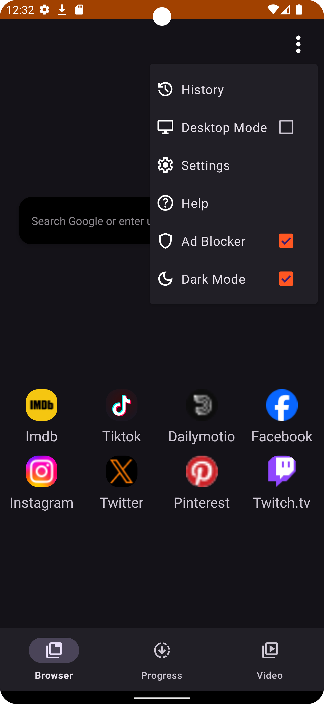
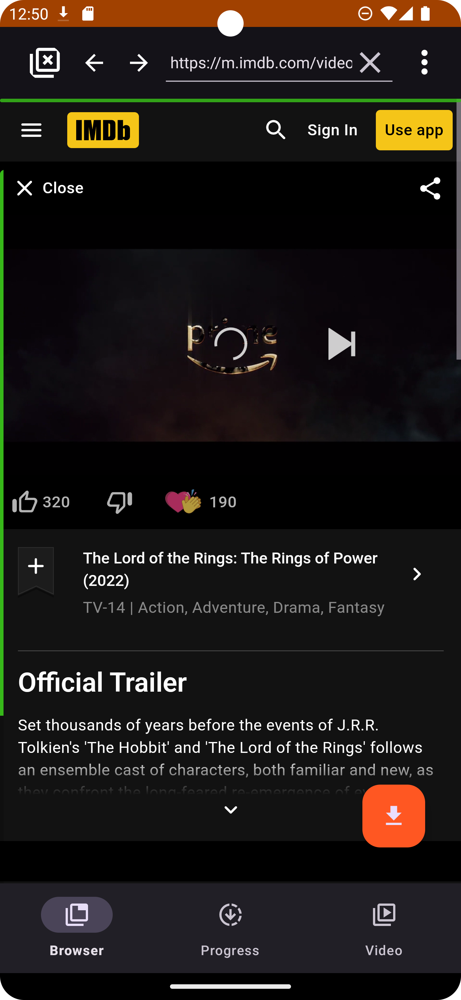
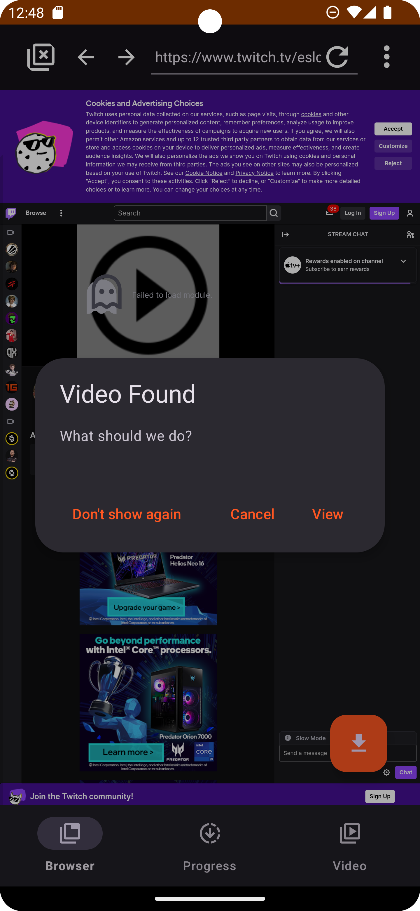
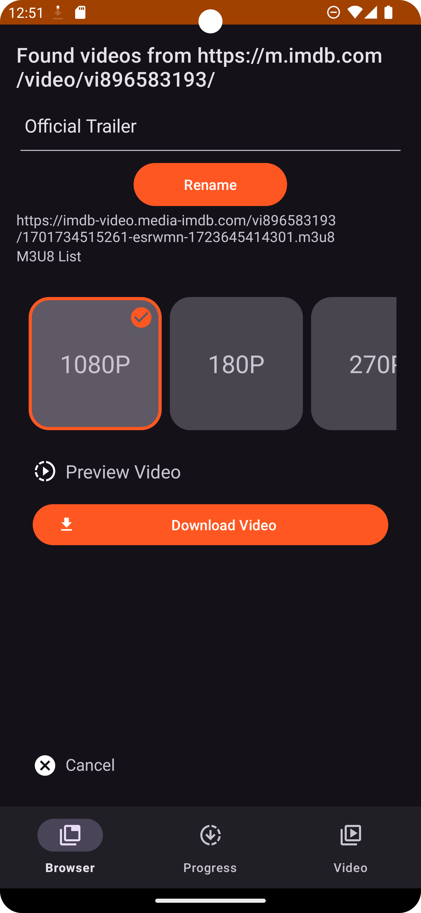
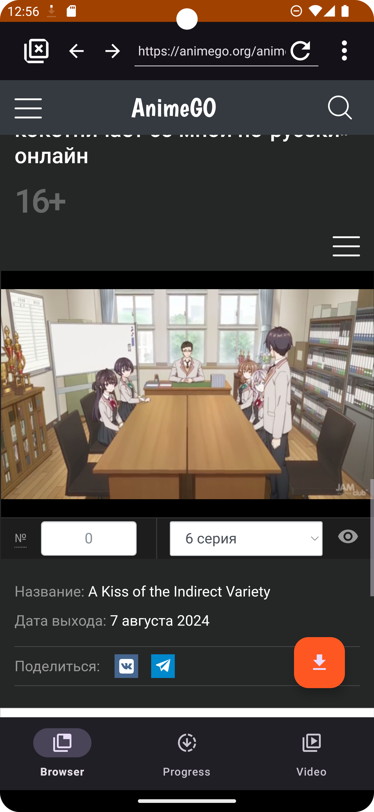
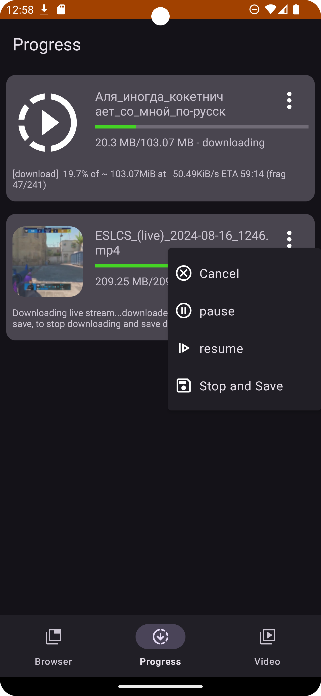
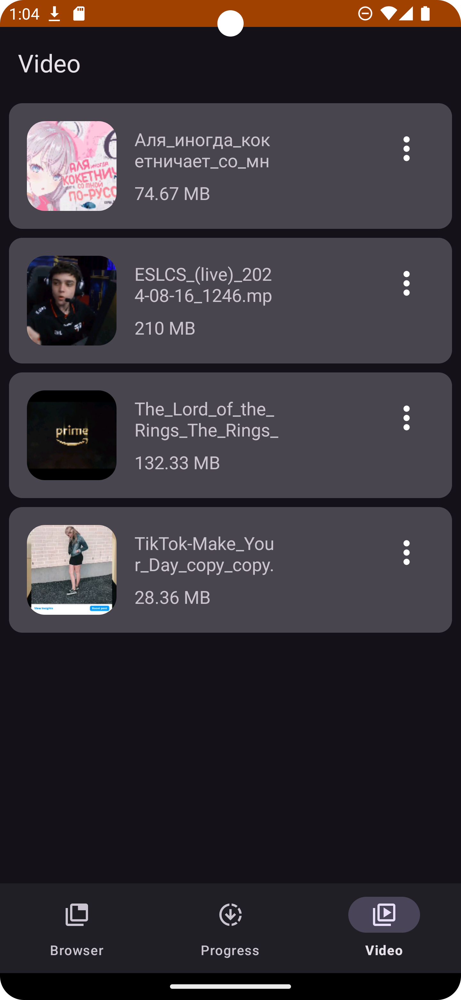
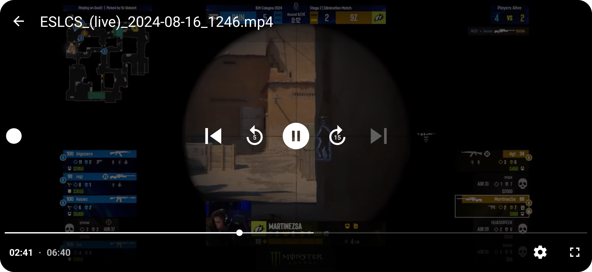

# SurfSave

SurfSave is an Android video downloader with a built-in browser, realtime media detection, a download queue, and multiple download engines for direct files, HLS/DASH streams, and yt-dlp supported sites.

> This project is intended for personal, research, interoperability, and educational use. Users are responsible for respecting website terms, copyright law, and local regulations.

## Highlights

- Built-in browser with bookmarks, history, cookies, search engines, share-target support, and realtime video detection.
- Multiple download paths: direct media, HLS/M3U8, DASH/MPD, live streams, custom regular downloads, and yt-dlp backed downloads.
- Download queue with configurable concurrency, reorder/later actions, duplicate detection, per-task logs, and clearer error details.
- Playlist and batch parsing for supported yt-dlp URLs.
- Cookie profiles with import/export for authenticated downloads.
- Filename templates for advanced naming control.
- Backup and restore for app data and selected settings.
- Offline playback with the integrated player.
- Optional proxy and secure DNS support backed by Xray/libv2ray native components.
- Page translation and language detection utilities.

## Current Identity

- App name: `SurfSave`
- Android application ID: `com.surfsave.browser`
- Kotlin/Android namespace: `com.myAllVideoBrowser`

The namespace is intentionally still the original internal package name. Do not rename it as part of small feature work; that is a separate migration.

## Screenshots

   
   

## Build

Prerequisites:

- JDK 21.
- Android SDK.
- Android NDK `27.3.13750724` when building the Go/Xray proxy library.
- Go when building the Go/Xray proxy library.

Fast diagnostic build without rebuilding the Go/Xray library:

```powershell
.\gradlew.bat --console=plain -PSKIP_GO_BUILD=true testDiagnosticUnitTest assembleDiagnostic lintDiagnostic
```

Full local release-style APK build with bundled native proxy library:

```powershell
.\gradlew.bat --console=plain exportDiagnosticApks
```

If `go` is not on `PATH`, pass `GO_EXECUTABLE`:

```powershell
.\gradlew.bat --console=plain -PGO_EXECUTABLE=C:\Go\bin\go.exe exportDiagnosticApks
```

Release signing reads these environment variables:

- `KEYSTORE_PATH`
- `KEYSTORE_PASSWORD`
- `KEY_ALIAS`
- `KEY_PASSWORD`

## Documentation

- [Privacy](PRIVACY.md)
- [Security](SECURITY.md)
- [Contributing](CONTRIBUTING.md)
- [Changelog](CHANGELOG.md)
- [Third-party notices](THIRD_PARTY_NOTICES.md)

## Credits

Thanks to the maintainers and contributors of youtube-dl-android, yt-dlp, FFmpeg/FFmpegKit, Xray/libv2ray, AndroidX, Material Components, OkHttp, Room, Dagger, RxJava, Media3, ML Kit, and the other open-source projects listed in [THIRD_PARTY_NOTICES.md](THIRD_PARTY_NOTICES.md).

Inspired by [cuongpm/youtube-dl-android](https://github.com/cuongpm/youtube-dl-android), [yausername/youtubedl-android](https://github.com/yausername/youtubedl-android), and [JunkFood02/Seal](https://github.com/JunkFood02/Seal).

## License

This project is licensed under the GNU General Public License v3.0. See [LICENSE](LICENSE).
