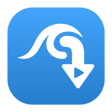
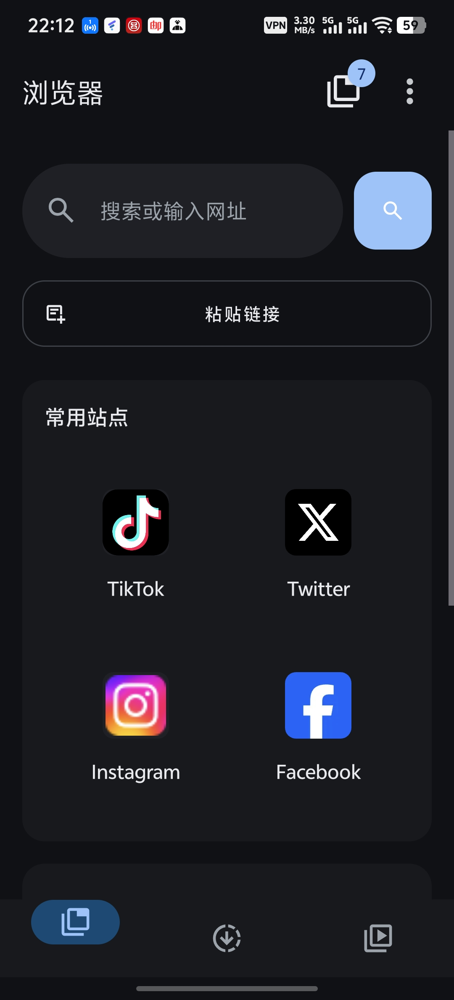
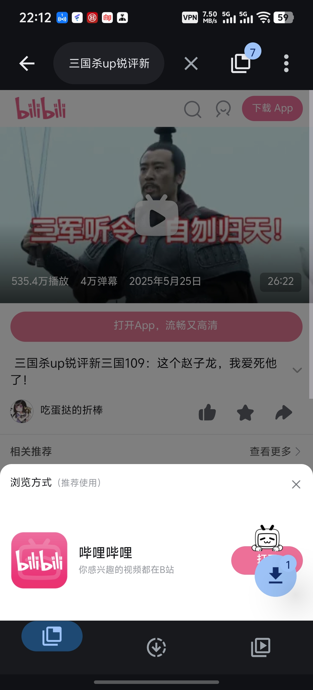
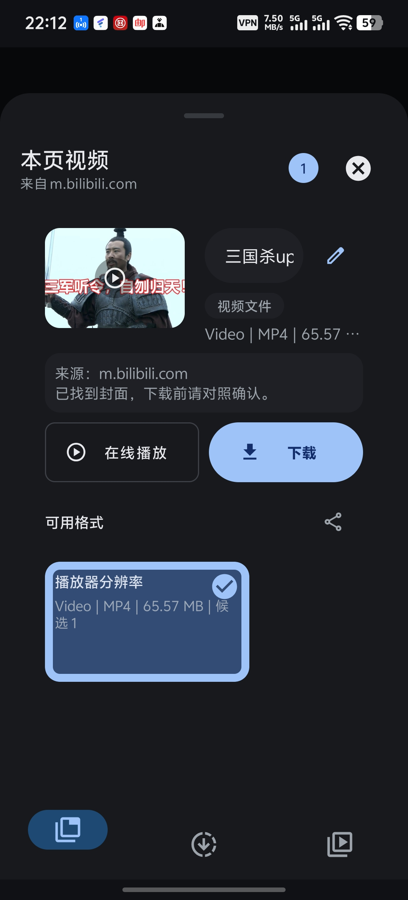
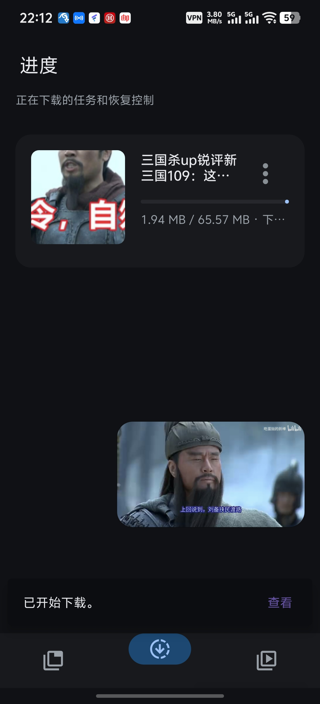
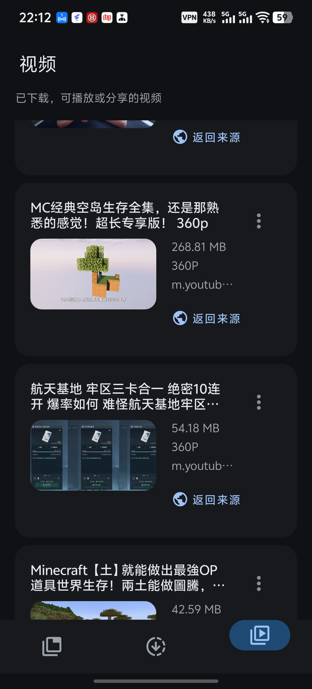
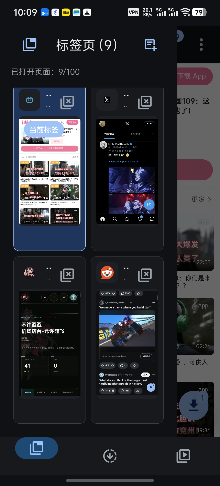
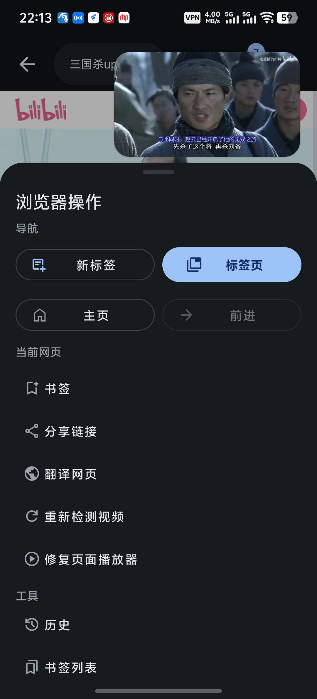

# SurfSave

<p align="center">
  
</p>

<p align="center"><strong>Android video downloader with a built-in browser — realtime media detection, multi-engine downloads, player selection, and Picture-in-Picture playback.</strong></p>

<p align="center">
  <a href="LICENSE"></a>
  
  <a href="https://github.com/songsongshuo785-art/SurfSave/releases"></a>
  
  
</p>

<p align="center"><b>English</b> | <a href="README_ZH.md">简体中文</a></p>

> ⚠️ <strong>Disclaimer</strong>: This project is intended for personal, research, interoperability, and educational use. Users are responsible for respecting website terms, copyright law, and local regulations.

## Why I built SurfSave

I had been looking for a browser that could give web videos a more consistent player experience while still letting me use players already installed on my phone. Many websites have frustrating built-in players, and some do not even support basic swipe seeking. (This is especially common on certain, shall we say, "magical little websites.")

I also tend to save videos I like so I can keep them in my own collection.

I use Picture-in-Picture a lot too, partly because it makes casual multitasking easier. One of my slightly unusual habits is keeping a video playing in a small window, or just listening to it, while reading comics or novels. I cannot be the only one who does this.

After looking around, I found almost no browser that met all three needs: online playback, video downloads, and Picture-in-Picture. Similar products usually fell short somewhere, and user feedback did not always lead anywhere.

So I decided to build an open-source browser around my own needs. When I find something missing, I can add it and get the improvement into users' hands quickly.

SurfSave is also one of my Vibe Coding experiments, and it still has rough edges. If you run into a problem, please report it through [GitHub Issues](https://github.com/songsongshuo785-art/SurfSave/issues). I will address it as best I can, and feedback is always welcome.

## How it works

1. Open a web page in SurfSave, or share a link from another app.
2. When the app detects eligible media requests, you can open the media details to review the available candidates.
3. From the media details, stream with SurfSave's built-in player or an installed external player, or choose a quality and add it to the download queue.
4. Manage and play downloaded media from the video library. Picture-in-Picture is available when using the built-in player.

## Features

### ⬇️ Download
- **Multi-engine downloads**: direct media links, HLS/DASH/live streams, and yt-dlp page parsing are handled by different engines, selected automatically based on the media type
- **Download queue**: configurable concurrency, reordering, "later", duplicate detection, per-task logs, and detailed error info
- Playlist & batch parsing for yt-dlp URLs
- Cookie profile import/export for authenticated downloads
- Filename templates for custom naming
- HLS AES-128 encryption support, including key rotation and IV handling

### ▶️ Player
- **Player selection**: web media uses SurfSave's built-in player by default; installed external players can be added through the Android system picker and selected directly on later visits
- **Online and offline playback**: the built-in player supports detected web media and downloaded media
- **Picture-in-Picture**: with the built-in player, enter manually or optionally on Home; play, pause, rewind, and fast-forward from the PiP window
- **Gesture controls**: double-tap the left/right half to seek; horizontal swipe to seek with a thumbnail preview
- Audio / subtitle track selection
- Playback speed and aspect ratio controls (fit / fill / crop)
- Smooth shared-element transition from thumbnail to player

### 🌐 Browser
- Full built-in browser: bookmarks, history, cookies, multi-tab, tab overview
- **Automatic media detection** while you browse
- Multiple search engines: Google, Bing, Baidu, DuckDuckGo
- Long-press links to open in the current window, a new window, or the background
- Page language detection with ML Kit translation (the first use of a language may download a translation model)

### 🔒 Privacy & Network
- Optional **Xray/libv2ray proxy** support
- **Secure DNS / DoH**
- Backup & restore for app data and selected settings (configurable in Settings)

## Supported scope & limitations

- DRM/Widevine-protected media cannot be downloaded; the DRM option in Settings only affects playback inside the WebView and does not bypass DRM download restrictions.
- Media detection and yt-dlp parsing may temporarily break after a site changes its structure, APIs, or login flow.
- Content behind a login may require WebView cookies or a manually imported cookie profile.
- When web media is handed to an external player, SurfSave passes only the media URL and title. WebView cookies and request headers such as `Authorization` and `Referer` are not forwarded, so login-protected or hotlink-protected media may work only in the built-in player.
- Live downloads are captured in real time from the moment the task starts; previously aired content cannot be retrieved.
- Online preview depends on network state, media encoding, and device decoding capability.

## Download & install

- **Download APK**: [GitHub Releases](https://github.com/songsongshuo785-art/SurfSave/releases)
- **Current source version**: `v0.8.30`
- **Requirements**: Android 7.0+ (API 24)

### Which APK should I choose?

Each release is split into several APKs by CPU architecture. Pick the one that matches your device:

| APK | Suitable for |
| --- | --- |
| `arm64-v8a` | Most modern phones (recommended) |
| `armeabi-v7a` | Older 32-bit ARM phones |
| `x86_64` | 64-bit Android emulators or a few Intel Android devices |
| `x86` | Older 32-bit emulators |
| `universal` | All architectures (largest; usually unnecessary) |

### Install steps

1. Allow "install unknown apps" for your file manager in device settings.
2. Open the downloaded APK and follow the prompts.
3. Overlay-install preserves your data only when installing from the same source with the same signature. If you want to keep your data, do not uninstall the old version first.

> For personal learning and research only. Respect site terms and copyright law.

## Screenshots

<p align="center">
  
  
  
  
  
  
  
  
</p>

> Screenshots show the current SurfSave interface; website content belongs to its respective providers.

## Build from source

Prerequisites: JDK 21, Android SDK, NDK `27.3.13750724`, Go (for the Xray proxy library).

```powershell
# Fast diagnostic build (skips Go/Xray rebuild)
.\gradlew.bat --console=plain -PSKIP_GO_BUILD=true testDiagnosticUnitTest assembleDiagnostic lintDiagnostic

# Export diagnostic APKs with bundled native proxy library (for testing, not a signed release)
.\gradlew.bat --console=plain exportDiagnosticApks

# If go is not on PATH
.\gradlew.bat --console=plain -PGO_EXECUTABLE=C:\Go\bin\go.exe exportDiagnosticApks
```

> **Release signing**: reads `KEYSTORE_PATH`, `KEYSTORE_PASSWORD`, `KEY_ALIAS`, `KEY_PASSWORD`.

> **Project identity**: App name `SurfSave`, applicationId `com.surfsave.browser`, Kotlin namespace `com.myAllVideoBrowser`.

## Documentation

[Privacy](PRIVACY.md) · [Security](SECURITY.md) · [Contributing](CONTRIBUTING.md) · [Changelog](CHANGELOG.md) · [Third-party notices](THIRD_PARTY_NOTICES.md)

## Credits

Thanks to the maintainers and contributors of **youtube-dl-android**, **yt-dlp**, **FFmpeg/FFmpegKit**, **Xray/libv2ray**, AndroidX, Material Components, OkHttp, Room, Dagger, RxJava, Media3, ML Kit, and the other open-source projects listed in [THIRD_PARTY_NOTICES.md](THIRD_PARTY_NOTICES.md).

Inspired by [cuongpm/youtube-dl-android](https://github.com/cuongpm/youtube-dl-android), [yausername/youtubedl-android](https://github.com/yausername/youtubedl-android), and [JunkFood02/Seal](https://github.com/JunkFood02/Seal).

## License

GNU General Public License v3.0. See [LICENSE](LICENSE).
